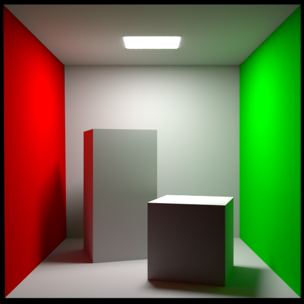
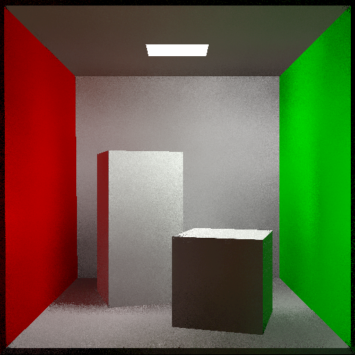
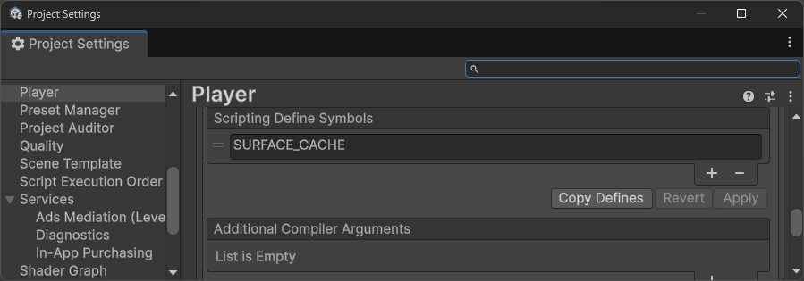
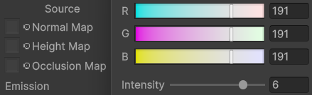

# UnitySCGI-CornellBox
Unity 6 Surface Cache Global Illumination Test with Cornell Box model.

This animation shows the first 200 frames at 30fps as a lossless GIF:

## Comparison

| Blender Cycles | Unity SCGI |
| :-: | :-: |
|  |  |

The image on the left was created using [Blender 5.0.1](https://www.blender.org/download/) with the **Cycles CPU renderer**.

The image on the right was created using [Unity 6000.5.0a8](https://unity.com/releases/editor/alpha/6000.5.0a8) with the **Surface Cache Global Illumination** renderer feature with the default values and a single emmissive material for the light source.

## Setup

- [Unity 6000.5.0a8](https://unity.com/releases/editor/alpha/6000.5.0a8) ([SRP Core 17.5.0](https://docs.unity3d.com/Packages/com.unity.render-pipelines.core@17.5/manual/index.html))
- Add `SURFACE_CACHE` to the [Player Scripting Define Symbols](https://docs.unity3d.com/6000.3/Documentation/Manual/dedicated-server-player-settings.html#ScriptCompilation) in the [Project Settings](https://docs.unity3d.com/6000.3/Documentation/Manual/class-ProjectSettingsWindow.html) window:   
- Add the `Surface Cache Global Illumination` renderer feature that should now appear in the [Add Renderer Feature](https://docs.unity3d.com/6000.3/Documentation/Manual/urp/urp-renderer-feature.html) drop down when you select your Universal Renderer Data asset:   
- Enable an emissive material or directional light (point/spot/area not yet supported). For the test scene the light emmitter Intensity was set to 6 to try to match the original Blender render:   

## Credits

The Blender file for the Cornell Box is slightly modified version of the one created by [LucasReSilva](https://github.com/LucasReSilva/Cornell-Box) (Apache-2.0 license):
- The light emitter cut out of the Cornell Box to experiment (unsuccessfully) with allowing a Directional Light to be the main light source instead of the light as an emissive material.
- The **scales** were all applied in Blender to make them `1.0` in Unity.
- The outer box had a **Solidify** modifier applied in Blender to prevent light leak in Unity.

The FBX file was exported from Blender using the [blender-to-unity-fbx-exporter](https://github.com/EdyJ/blender-to-unity-fbx-exporter) tool by [EdyJ](https://github.com/EdyJ).

The info about using `SURFACE_CACHE` was mentioned by [Neonage](https://discussions.unity.com/u/neonage/summary) on the Unity discussion forum in comment made on the [Render Pipelines strategy for 2026](https://discussions.unity.com/t/render-pipelines-strategy-for-2026/1710004/440) post on 10th March 2026.